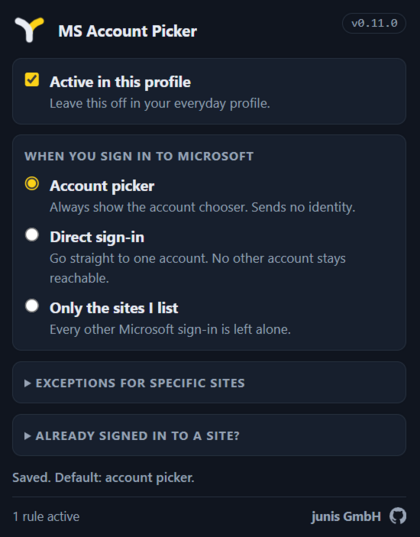
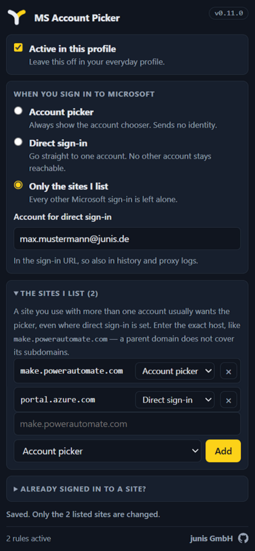

# MS Account Picker

**Choose which Microsoft account you sign in with** — instead of being signed in automatically with whichever account Windows or the browser already knows.

On a managed Windows device the browser carries your Windows identity into every browser profile. Open a Microsoft site and it signs you in with that account: no prompt, no choice. If you hold a second Microsoft account — a separate admin identity, for instance — that is the account you did not want.

This extension gives the choice back. It adds **one query parameter** to Microsoft's sign-in request, so you either get the account chooser or land straight on the account you configured. That is the whole mechanism.

> **[Install from the Chrome Web Store](https://chromewebstore.google.com/detail/ms-account-picker/bapkfcamfgmaoaedkdljdmgpedpffjen)** · Manifest V3, works in Edge and Chrome.
> The store currently serves **0.11.0**. This repository is one patch ahead — see [CHANGELOG.md](CHANGELOG.md).

| | |
| --- | --- |
|  |  |

## What you can set

| Mode | What happens when you sign in |
| --- | --- |
| **Account picker** | The account chooser always appears. Nothing about your identity is sent to get there. |
| **Direct sign-in** | Straight to the one account you entered. |
| **Only the sites I list** | Nothing changes anywhere except on the sites you name yourself. |

Two things sit alongside the mode:

- **Per site.** A site you use with more than one account can keep the picker while everything else goes direct — or the other way round. A site can also be set to **Browser default**, which means this extension leaves it alone entirely.
- **Off per profile.** The extension does nothing at all until you switch it on in *this* browser profile. That is what makes it safe to install everywhere and arm only where you want it — a profile that was never activated registers no rule.

## What it does not do

No telemetry, no analytics, no error reporting — nothing leaves your browser. No account, no server. No remote code and no third-party libraries: zero dependencies. It has no access to the Microsoft portals themselves, only to the sign-in endpoint `login.microsoftonline.com`, and it never reads the content of any request.

The parameter is applied by the browser's own `declarativeNetRequest` engine. The extension supplies a rule and never observes the requests that rule matches.

**Two limits worth knowing.** A site you are already signed in to does not ask again, so no setting can reach it — the popup carries a sign-out link for exactly that. And sign-in flows that use WS-Federation have no equivalent parameter and are not covered.

## For administrators

The extension is built to be rolled out browser-wide by policy while staying inert in the everyday profile. Deployment, the `ExtensionSettings` policy and the rollout model are in [docs/deployment.md](docs/deployment.md).

> 🔴 The extension operates **inside the authentication flow of privileged accounts** and is classified as a T0 influence path. Whoever can ship an update to it could rewrite `redirect_uri` instead of `prompt`. Every change to the manifest, to permissions, or to a rule condition therefore requires a blocking security review — see [docs/security-review.md](docs/security-review.md), which also states what is known and accepted.

## Documentation

| File | Contents |
| --- | --- |
| [CLAUDE.md](CLAUDE.md) | Binding project rules, hard architecture constraints, glossary |
| [docs/architecture.md](docs/architecture.md) | The approach, rejected alternatives, empirical status |
| [docs/security-review.md](docs/security-review.md) | T0 classification, requirements, stop criterion, data protection |
| [docs/deployment.md](docs/deployment.md) | `ExtensionSettings` policy, signing, rollout, rollback |
| [docs/store-listing.md](docs/store-listing.md) | The store listing texts, permission justifications, privacy answers |
| [docs/verification-matrix.md](docs/verification-matrix.md) | Manual test matrix — portals × session states |
| [docs/open-questions.md](docs/open-questions.md) | Open decisions; shrinks as the project proceeds |
| [CHANGELOG.md](CHANGELOG.md) | What each version changed — the audit surface for auto-update |
| [SECURITY.md](SECURITY.md) | How to report a vulnerability, and what is already known and accepted |

## Development

No build step, no dependencies. What is in `src/` is what runs in the browser.

```bash
bash .claude/hooks/verify.sh       # gate: manifest JSON, node --check, unit tests
node --test tests/unit/*.test.js   # unit tests on their own
node tests/e2e/dnr.e2e.js          # e2e: the loaded extension against a local fake endpoint
python3 tools/package.py --check   # reproducible ZIP, packed twice to prove it
```

The e2e run needs a Chrome binary (`CHROME_BIN` or the Puppeteer cache) and `openssl`. It is deliberately not part of the gate — it takes about 30 s and needs a browser. It never contacts Microsoft: `--host-resolver-rules` points `login.microsoftonline.com` at a local server, and what gets tested is still the production rule.

Load the extension: `edge://extensions` → developer mode → **Load unpacked** → the `src/` directory.

## Claude Code

`.claude/skills/` holds four procedures: `verify` (success criteria and the gate), `security-review` (the blocking checklist for changes to the manifest, permissions or rules), `dnr-rule-check` (static rule inspection: RE2, `resourceTypes`, loop risk, endpoint coverage), and `release` (version rules, reproducible packaging, the artefact register).

`verify.sh` is additionally wired as a `Stop` hook — a red tree blocks the turn from ending.

## Licence

[Apache-2.0](LICENSE). Copyright 2026 junis GmbH.

The junis name, the word mark and the logo files under `assets/logo/`, `assets/screenshots/`, `assets/store/` and `src/icons/` are brand assets and are **not** covered by the code licence — see [NOTICE](NOTICE). Fork the code freely; replace the mark.
